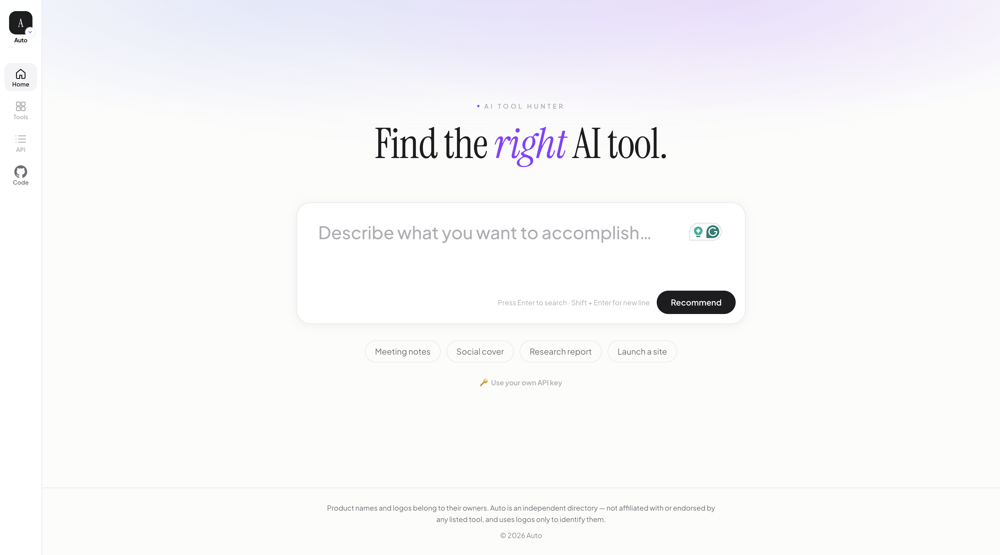
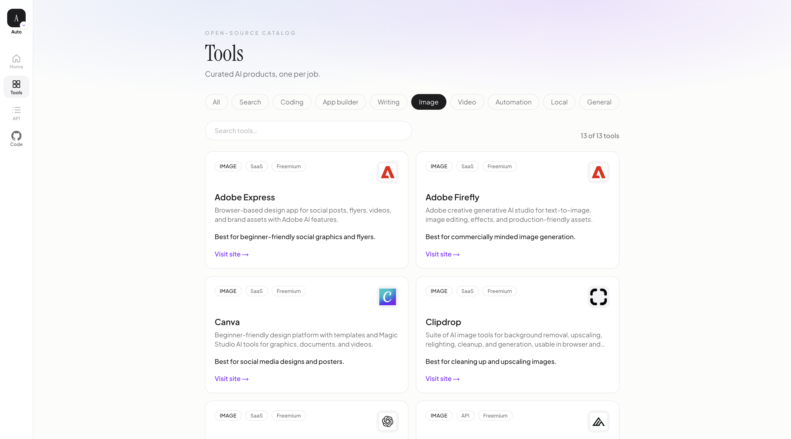
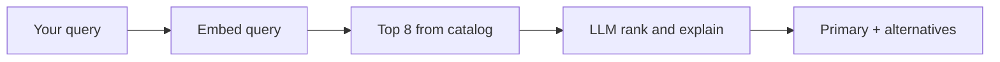

# Auto — Open-Source AI Tool Hunter

> **Auto does not answer your question. It tells you which existing AI product to use.**

[](LICENSE)
[](https://nodejs.org)
[](https://github.com/ZhiweiChen-coder/Auto/actions/workflows/web-ci.yml)
[](https://github.com/ZhiweiChen-coder/Auto/actions/workflows/validate-catalog.yml)
[](CONTRIBUTING.md)

<p align="center">
  
</p>

Unlike generic chatbots or self-hosted agents, Auto hunts down the best **ready-made tool** for your **task** from a curated, community-editable catalog.

- Need live web research with citations? → [Perplexity](https://www.perplexity.ai)
- Need a landing page today? → [Lovable](https://lovable.dev), [v0](https://v0.dev), or [Bolt](https://bolt.new)
- Need to refactor a large codebase? → [Cursor](https://cursor.com)

## Table of contents

- [Features](#features)
- [How it works](#how-it-works)
- [Quick start](#quick-start)
- [Environment variables](#environment-variables)
- [Public API](#public-api)
- [Project structure](#project-structure)
- [Roadmap](#roadmap)
- [Contributing](#contributing)
- [License](#license)

## Features

- **Hybrid routing** — embeddings shortlist + LLM rank (grounded to catalog only)
- **Clarification** — vague or ambiguous queries get follow-up questions instead of weak picks
- **Recent searches** — stored locally in your browser
- **Feedback loop** — quick result ratings saved for recommendation tuning
- **Shareable results** — copy link with query preserved
- **Browse + search** — filter the full catalog
- **Public API** — see `/docs` in the app or [openapi.yaml](openapi.yaml)

<p align="center">
  
</p>

## How it works



1. **Embeddings** shortlist the most relevant tools from `data/tools/`.
2. **LLM** picks only from that shortlist and explains why (no hallucinated products).

## Quick start

### Prerequisites

- Node.js 20+
- [pnpm](https://pnpm.io) 9+
- OpenAI API key (for embeddings at index time and recommendations at runtime)

### Setup

```bash
pnpm install
pnpm build

# Generate embeddings
# Production quality (requires OPENAI_API_KEY):
export OPENAI_API_KEY=sk-...
pnpm index-catalog

# Dev/CI mock embeddings (committed by default; ranker still needs OPENAI_API_KEY):
pnpm index-catalog:mock

# Run the web app + API
pnpm dev
```

Open [http://localhost:3000](http://localhost:3000).

Deployment notes live in [docs/deployment.md](docs/deployment.md).

## Environment variables

Create **`apps/web/.env.local`** (or repo root `.env.local`) with your OpenAI key:

```bash
cp apps/web/.env.example apps/web/.env.local
# Edit apps/web/.env.local and set OPENAI_API_KEY=sk-...
```

Restart the dev server after saving.

| Variable | Description |
|----------|-------------|
| `OPENAI_API_KEY` | **Required** — powers recommendations and catalog indexing |
| `EMBEDDING_MODEL` | Default: `text-embedding-3-small` |
| `RANKER_MODEL` | Default: `gpt-4o-mini` |
| `INTENT_MODEL` | Default: `gpt-4o-mini`; routes single vs workflow tasks |
| `PLANNER_MODEL` | Default: `RANKER_MODEL`; plans workflow steps |
| `APP_MODE` | Default: `local`; set `open` for hosted shared-key + credits |
| `NEXT_PUBLIC_APP_URL` | Public app URL for checkout redirects and docs examples |
| `ALLOWED_ORIGIN` | Optional CORS origin for hosted open mode |
| `ADMIN_TOKEN` | Sign-in secret for the admin area. Set it, then paste the same value into the **Sign in** form to reach `/admin/feedback`. Unset = admin login is disabled (login returns `403`). Generate one with `openssl rand -base64 24`. |
| `SESSION_SECRET` | Signs admin and anonymous credit cookies. Falls back to a value derived from `ADMIN_TOKEN` if unset, but set a dedicated long random secret (`openssl rand -base64 32`) in production. Changing it invalidates existing sessions. |
| `AUTH_SECRET` | Required for Google sign-in — signs Auth.js JWT sessions. `openssl rand -base64 32`. |
| `AUTH_GOOGLE_ID` / `AUTH_GOOGLE_SECRET` | Optional — enable **Continue with Google**. From a Google Cloud OAuth client (redirect URI `<app-url>/api/auth/callback/google`). Unset = the button shows but sign-in won't complete. In `open` mode, an anon user's credits merge into their account on first sign-in. |
| `FEEDBACK_STORE` | Default: `file`; use `webhook` for deployed/serverless feedback |
| `FEEDBACK_WEBHOOK_URL` | Optional — receives feedback records in production |
| `FEEDBACK_WEBHOOK_SECRET` | Optional bearer token for the feedback webhook |
| `SUPABASE_URL` / `SUPABASE_SERVICE_ROLE_KEY` | Required when `APP_MODE=open` |
| `FREE_CREDITS` | Default: `30` |
| `UPSTASH_REDIS_REST_URL` / `UPSTASH_REDIS_REST_TOKEN` | Optional shared rate limit backend |
| `STRIPE_SECRET_KEY` / `STRIPE_PRICE_ID` / `STRIPE_WEBHOOK_SECRET` | Optional credit top-ups |
| `CREDITS_PER_PURCHASE` | Default: `100` |

## Public API

### `POST /api/v1/recommend`

```bash
curl -X POST http://localhost:3000/api/v1/recommend \
  -H "Content-Type: application/json" \
  -d '{"query": "find SEC filings for Apple with sources", "limit": 2}'
```

**Response:**

```json
{
  "query": "find SEC filings for Apple with sources",
  "primary": {
    "toolId": "perplexity",
    "confidence": "high",
    "reason": "..."
  },
  "alternatives": [{ "toolId": "you-com", "reason": "..." }],
  "workflowTip": "optional",
  "avoid": "optional"
}
```

### Bring your own key (BYOK)

Pass your OpenAI key instead of using the server default:

```bash
curl -X POST http://localhost:3000/api/v1/recommend \
  -H "Content-Type: application/json" \
  -H "Authorization: Bearer sk-your-key" \
  -d '{"query": "build a SaaS dashboard"}'
```

### Other endpoints

| Method | Path | Description |
|--------|------|-------------|
| `GET` | `/api/v1/tools` | List catalog (`?category=search&page=1`) |
| `GET` | `/api/v1/tools/:id` | Single tool |
| `POST` | `/api/v1/feedback` | Save lightweight recommendation feedback |
| `GET` | `/api/v1/health` | Health + catalog version |

Rate limit: 20 requests/minute per IP on `/api/v1/recommend`.

## Project structure

```
apps/web/           Next.js UI + API routes
packages/catalog/   Zod schemas + YAML loader
packages/core/      Hybrid recommend engine
data/tools/         Curated tool YAML files
data/embeddings.json Precomputed vectors (generated)
data/feedback.jsonl Local feedback log (ignored)
scripts/            index-catalog, validate-catalog
```

## Roadmap

- [ ] MCP server for agent integrations
- [ ] Production embedding index in CI
- [ ] Community voting on tool entries

## Contributing

Contributions are welcome! See [CONTRIBUTING.md](CONTRIBUTING.md) to add or edit tools in `data/tools/`.

## License

[MIT](LICENSE) © Auto contributors
